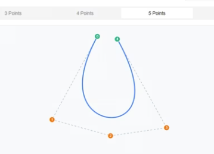

# 🎨 Bézier Curve Editor

An interactive Bézier curve editor built with **Next.js**, **Shadcn UI**, and **Tailwind CSS**. Experiment with Bézier curves through two powerful editing modes:

- **Poly Bézier Curves**: Create smooth, connected curves with multiple cubic Bézier segments.
- **Fixed Control Points**: Explore single Bézier curves with a user-defined number of control points.

## 📸 Live Demo

#### Try it on [https://bezier-curve-peach.vercel.app](https://bezier-curve-peach.vercel.app)

#### Or watch it on [https://vimeo.com/1080742494](https://vimeo.com/1080742494)

[](https://vimeo.com/1080742494)

---

## 🎮 Controls

- **Add Point**: Click on the canvas to add a control point.
- **Move Point**: Drag any control point to reposition it.
- **Remove Point**: Press `D` or click the **Remove** button to delete the last point.

---

## ✨ Features

### Poly Bézier Curves Mode

- Add unlimited points to create connected cubic Bézier segments.
- Every 4 points form a segment (1 start, 2 control points, 1 end).
- Segments connect smoothly for continuous curves.
- Color-coded points with labels for visual clarity.
- Drag points to dynamically reshape curves.

### Fixed Control Points Mode

- Select 3–6 control points to generate a single Bézier curve.
- Supports linear, quadratic, cubic, and higher-order Bézier curves.
- Visualizes control polygons and animates the curve for better understanding.

---

## 🧠 Technologies Used

- **Next.js** (React framework with server-side rendering)
- **TypeScript** (Type-safe JavaScript)
- **Tailwind CSS** (Utility-first CSS framework)
- **Shadcn UI** (Radix-based UI components)
- **Lucide Icons** (Lightweight icon library)

---

## 🚀 Getting Started

### Prerequisites

- **Node.js** (v16 or higher)
- **npm** (v8 or higher)

### 1. Clone the Repository

```bash
git clone https://github.com/Lixsr/ComputerGraphics-Projects.git
cd bezier-curve
```

### 2. Install Dependencies

```bash
npm install --legacy-peer-deps
```

### 3. Run the Development Server

```bash
npm run dev
```

Open [http://localhost:3000](http://localhost:3000) in your browser to view the app.

---

## 🗂️ Project Structure

```plaintext
├── components/
│   ├── bezier-curve-editor.tsx        # Tab switcher for both modes
│   ├── fixed-bezier-curve.tsx         # Single curve editor
│   ├── poly-bezier-curves-editor.tsx  # Multi-curve editor
│   └── ui/                            # Shadcn UI components (Card, Button, Tabs...)
├── lib/
│   └── bezier.ts                      # Bézier curve calculation logic
├── types/
│   └── index.ts                       # TypeScript type definitions
├── app/
│   └── page.tsx                       # Main entry point
├── public/                            # Static assets
└── README.md                          # Project documentation
```

---
