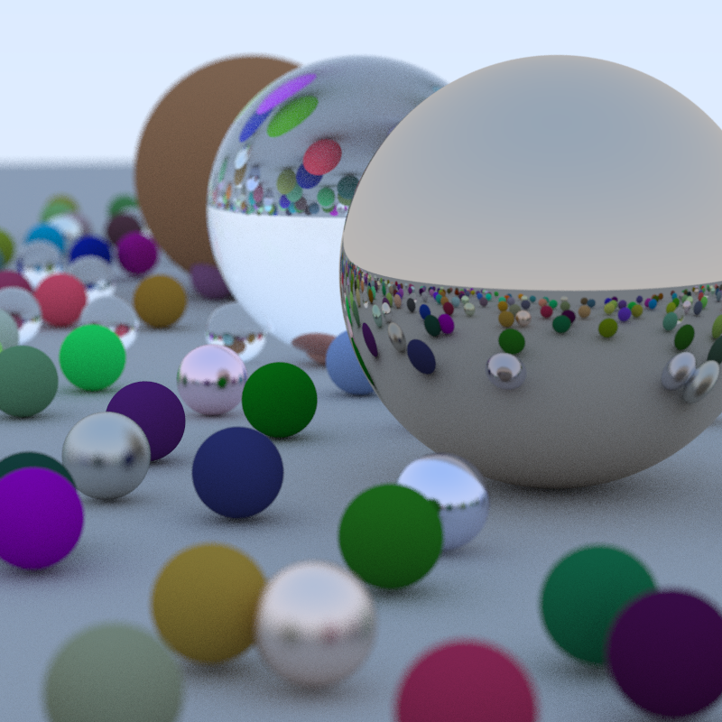

# Ray Tracer in Java

This is a simple ray tracing program written in Java. It renders a scene with three spheres (red, green, and blue) using basic ray tracing techniques. The program uses Java's `javax.swing` library to display the rendered image in a window.

---

## Features

- **Sphere Rendering**: Renders a 2D projection of a 3D scene.
- **Ray-Sphere Intersection**: Uses mathematical formulas to compute intersections between rays and spheres.
- **Interactive Display**: Displays the rendered image in a window using Java's `JFrame`.

---

## Prerequisites

To run this program, you need:

- **Java Development Kit (JDK)**: Ensure you have JDK 8 or later installed.

---

## How to Run the Program

### 1. Clone or Download the Code

- Clone this repository or download the `Ray-Tracing` folder to your local machine.

### 2. Run the Program on Different Platforms

#### Step 1: Open a Terminal or Command Prompt

- **Windows**: Open Command Prompt or PowerShell by searching for it in the Start menu.
- **Mac**: Open the Terminal application (found in Applications > Utilities).
- **Linux**: Open a terminal using your preferred method.

### 2. Run the Program on Different Platforms

#### Step 1: Open a Terminal or Command Prompt

- **Windows**: Open Command Prompt or PowerShell by searching for it in the Start menu.
- **Mac**: Open the Terminal application (found in Applications > Utilities).
- **Linux**: Open a terminal using your preferred method.

#### Step 2: Navigate to the Program Directory

Use the `cd` command to navigate to the directory containing the `RayTracer.java` file. For example:

```bash
cd path/to/your/directory
```

#### Step 3: Compile and Run the Program

Compile and run the program using the following commands:

```bash
javac RayTracer.java
java RayTracer
```

**Note**: Ensure that Java is properly installed and added to your system's PATH. You can verify this by running:

```bash
java -version
```

If Java is not installed or configured, refer to your operating system's instructions for setting it up.

---

## 📁 Project Structure

```
.
├── Camera.java        # Perspective camera with depth-of-field support
├── Vector.java        # 3D vector operations
├── Ray.java           # Lightweight ray representation
├── Hittable.java      # Interface for ray-intersectable objects
├── HitRecord.java     # Stores ray-object intersection info
├── HittableList.java  # Composite list of hittable objects
├── Sphere.java        # Sphere geometry with material support
├── Material.java      # Abstract base class for materials
├── Lambertian.java    # Diffuse material (matte)
├── Metal.java         # Reflective metal material
├── Dielectric.java    # Transparent material (e.g., glass)
├── Light.java         # Supports ambient, point, and directional lights
├── RayTracer.java     # Orchestrates the rendering process
```

---

## 📄 File Descriptions

### **Camera.java**

Models a perspective camera with depth-of-field.

#### Attributes:

- `origin`, `LLCorner`, `horizontal`, `vertical`: Define viewport in 3D space.
- `u, v, w`: Camera orientation basis vectors.
- `lensRadius`: Used for simulating depth-of-field.
- `rand`: Random number generator for sampling.

#### Key Methods:

- `getRay(s, t, rand)`: Generates a ray through a pixel with lens sampling.
- `randomInUnitDisk(rand)`: Random point in a unit disk for lens blur.

#### 🔑 Features:

- Depth-of-field simulation via aperture sampling.
- Configurable orientation (`lookFrom`, `lookAt`, `vup`), FOV, and focus.

---

### **Vector.java**

Defines a robust 3D vector class.

#### Attributes:

- `x, y, z`: Coordinates (double).

#### Methods:

- Arithmetic: `add`, `subtract`, `multiply`, `scale`, `negate`
- Math: `dot`, `cross`, `length`, `normalize`
- Random: `random(rand, min, max)`

#### 🔑 Features:

- Built for geometric and lighting operations.
- Enables random scattering for realistic materials.

---

### **Ray.java**

Represents a ray in 3D space.

#### Attributes:

- `origin`, `direction`: Both are `Vector` objects.

#### Methods:

- `at(t)`: Returns a point along the ray at distance `t`.

---

### **Hittable.java**

Interface for objects intersectable by rays.

#### Method:

- `hit(ray, tMin, tMax, hitRecord)`: Checks ray-object intersection.

---

### **HitRecord.java**

Stores data about ray-object intersections.

#### Attributes:

- `p`: Hit point.
- `normal`: Surface normal.
- `mat`: Material hit.
- `t`: Ray parameter.
- `frontFace`: True if hit front face.

#### Method:

- `setFaceNormal(ray, normal)`: Adjusts normal direction based on ray.

---

### **HittableList.java**

Scene container for multiple objects.

#### Attributes:

- `objects`: List of `Hittable` objects.

#### Methods:

- `add(obj)`: Adds to scene.
- `hit(...)`: Returns the closest intersection.

---

### **Sphere.java**

Defines a 3D sphere.

#### Attributes:

- `center`, `radius`, `mat` (material)

#### Method:

- `hit(...)`: Performs ray-sphere intersection and returns hit details.

---

### **Material.java**

Abstract base class for surface materials.

#### Method:

- `scatter(ray, hitRecord, attenuation, scatteredRay, rand)`: Computes scattered ray and color attenuation.

---

### **Lambertian.java**

Implements diffuse surfaces.

#### Attributes:

- `albedo`: Base color (`Vector`)

#### Method:

- `scatter(...)`: Randomly scatters rays with `albedo` attenuation.

---

### **Metal.java**

Implements reflective material.

#### Attributes:

- `albedo`: Color
- `fuzz`: Degree of roughness

#### Method:

- `scatter(...)`: Reflects ray with optional fuzziness.

---

### **Dielectric.java**

Implements transparent (refractive) materials like glass.

#### Attribute:

- `indexOfRefraction`: Controls refraction/reflection

#### Method:

- `scatter(...)`: Uses Snell's Law and Fresnel effect to scatter rays.

---

### **Light.java**

Models different types of lights.

#### Attributes:

- `type`: `"ambient"`, `"point"`, `"directional"`
- `intensity`: Brightness
- `position`, `direction`: Depending on type

---

### **RayTracer.java**

Main class to build the scene and render the image.

#### Constants:

- `WIDTH`, `HEIGHT`: Image size (800x800)
- `SAMPLES_PER_PIXEL`: Anti-aliasing (default: 100)
- `MAX_DEPTH`: Max recursion depth (default: 50)
- Camera settings: `FOCUS_DIST`, `APERTURE`, `FOV`, etc.

#### Attributes:

- `scene`: A `HittableList` of objects
- `spheres`, `lights`: Object and light lists
- `camera`: The configured `Camera` instance

#### Methods:

- `generateScene()`: Builds the scene with one ground sphere and many small random spheres (Lambertian, Metal, Dielectric).
- `render(filename)`: Renders scene with anti-aliasing and writes PNG.
- `rayColor(ray, scene, depth, rand)`: Returns color from recursive ray tracing.
- `clamp(...)`: Limits color values before output.

---

## 🎯 Features

**Diffuse, Reflective, and Transparent Materials**  
 **Multi-sample Anti-aliasing**  
 **Recursive Ray Tracing**  
 **Depth-of-Field Simulation**  
 **Snell’s Law and Fresnel Equations**  
 **Modular Scene Composition**  
 **Ambient, Point, and Directional Lights**

---

## 🖼️ Output

Running the program will generate:

```
Generated_Image.png
```

The rendered image includes:

- Diffuse and reflective materials
- Transparent glass-like surfaces
- Depth-of-field and anti-aliasing
- Physically-based lighting

---

The rendered image will look like this:

