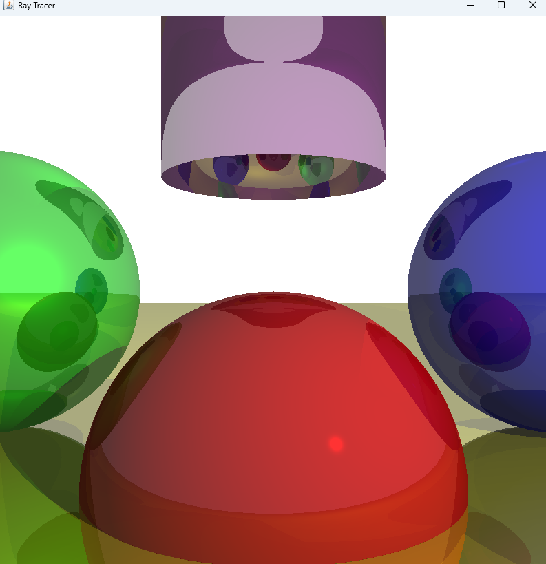

# Ray Tracer in Java

This is a simple ray tracing program written in Java. It renders a scene with three spheres (red, green, and blue), a large yellow sphere as a "floor," and a purple cylinder using advanced ray tracing techniques. The program uses Java's `javax.swing` library to display the rendered image in a window.

---

## Features

- **Sphere Rendering**: Renders a 2D projection of a 3D scene with spheres.
- **Cylinder Rendering**: Adds support for rendering cylinders with customizable radius, height, and material properties.
- **Ray-Sphere Intersection**: Uses mathematical formulas to compute intersections between rays and spheres.
- **Ray-Cylinder Intersection**: Implements ray-cylinder intersection logic to render cylindrical objects.
- **Lighting**:
  - **Ambient Lighting**: Provides uniform illumination across the scene.
  - **Point Lighting**: Simulates light emanating from a specific point in 3D space, casting shadows and highlights.
  - **Directional Lighting**: Models light from a distant source (e.g., the sun) with parallel rays.
  - **Diffuse Reflection**: Calculates realistic shading based on the angle between light and surface normals.
  - **Specular Reflection**: Adds shiny highlights based on the view direction and light reflection.
- **Shadows**: Enhances realism by simulating the occlusion of light from point and directional sources. Objects cast shadows onto other surfaces when they block light paths, computed using ray intersection tests to determine if light reaches a point.
- **Reflections**: Simulates mirror-like reflections on sphere and cylinder surfaces using recursive ray tracing, blending local and reflected colors based on reflectivity.
- **Interactive Display**: Displays the rendered image in a window using Java's `JFrame`.

---

## Prerequisites

To run this program, you need:

- **Java Development Kit (JDK)**: Ensure you have JDK 8 or later installed.

---

## How to Run the Program

### 1. Clone or Download the Code

- Clone this repository or download the `Ray-Tracing` folder to your local machine.

### 2. Run the Program on Different Platforms

#### Step 1: Open a Terminal or Command Prompt

- **Windows**: Open Command Prompt or PowerShell by searching for it in the Start menu.
- **Mac**: Open the Terminal application (found in Applications > Utilities).
- **Linux**: Open a terminal using your preferred method.

#### Step 2: Navigate to the Program Directory

Use the `cd` command to navigate to the directory containing the `RayTracer.java` file. For example:

```bash
cd path/to/your/directory
```

#### Step 3: Compile and Run the Program

Compile and run the program using the following commands:

```bash
javac RayTracer.java
java RayTracer
```

**Note**: Ensure that Java is properly installed and added to your system's PATH. You can verify this by running:

```bash
java -version
```

If Java is not installed or configured, refer to your operating system's instructions for setting it up.

### 4. View the Output

A window will open displaying the rendered image of three spheres (red, green, and blue), a purple cylinder, and a large yellow sphere as the floor, illuminated by ambient, point, and directional lights, featuring realistic shadows, highlights, and reflective surfaces.

---

## Code Structure

The program consists of the following classes:

### 1. `Point3D`

Represents a 3D point or vector. It includes methods for vector math:

- `subtract`: Subtracts two vectors.
- `multiply`: Multiplies a vector by a scalar.
- `dot`: Computes the dot product of two vectors.
- `length`: Computes the length of a vector.
- `normalize`: Normalizes a vector to unit length.

### 2. `Sphere`

Represents a sphere in 3D space. It has:

- `center`: The center of the sphere (a `Point3D`).
- `radius`: The radius of the sphere.
- `color`: The color of the sphere.
- `specular`: Specular exponent for shininess.
- `reflective`: Reflectivity coefficient controlling the strength of reflections.

### 3. `Cylinder`

Represents a cylinder in 3D space. It has:

- `center`: The center of the cylinder (a `Point3D`).
- `radius`: The radius of the cylinder.
- `height`: The height of the cylinder.
- `color`: The color of the cylinder.
- `specular`: Specular exponent for shininess.
- `reflective`: Reflectivity coefficient controlling the strength of reflections.

### 4. `Light`

Represents a light source in the scene. It supports:

- `type`: `AMBIENT`, `POINT`, or `DIRECTIONAL` light.
- `intensity`: Strength of the light.
- `position`: Position of the light (for point lights).
- `direction`: Direction of the light (for directional lights, normalized).

### 5. `RayTracer`

The main class that handles rendering and display. It includes:

- **Scene Setup**: Defines the three spheres, a large yellow "floor" sphere, a purple cylinder, and three light sources (ambient, point, and directional).
- **Ray Tracing Logic**:
  - `canvasToViewport`: Maps canvas coordinates to viewport coordinates.
  - `intersectRaySphere`: Computes the intersection of a ray with a sphere.
  - `intersectRayCylinder`: Computes the intersection of a ray with a cylinder.
  - `closestIntersection`: Finds the nearest object intersected by a ray, used for primary rays, shadow checks, and reflections.
  - `reflectRay`: Calculates the reflected ray direction for mirror-like reflections using the formula `R = 2 * N * (N · R) - R`.
  - `traceRay`: Traces a ray recursively (up to a depth of 3) to compute the color, incorporating local lighting and reflected colors blended based on the object's reflectivity.
- **Lighting Computation**:
  - `computeLighting`: Calculates total light intensity at a point, including ambient, diffuse, and specular components. Shadows are implemented by casting a shadow ray from the intersection point to each light source (using `closestIntersection`). If an object intersects this ray before the light (within `tMax`), the light’s contribution is skipped, creating a shadow. For point lights, `tMax` is 1 (distance to the light), while for directional lights, it’s infinity.
- **Color Utilities**:
  - `multiplyColor`: Scales a color by a scalar (e.g., lighting intensity).
  - `blendColors`: Combines local and reflected colors based on a reflectivity weight.
- **Rendering**:
  - `render`: Renders the scene by tracing rays for each pixel with recursive reflection support.
  - `paintComponent`: Draws the rendered image on the screen.
- **Main Method**: Initializes the program and displays the rendered image in a window.

---

The rendered image will look like this:

